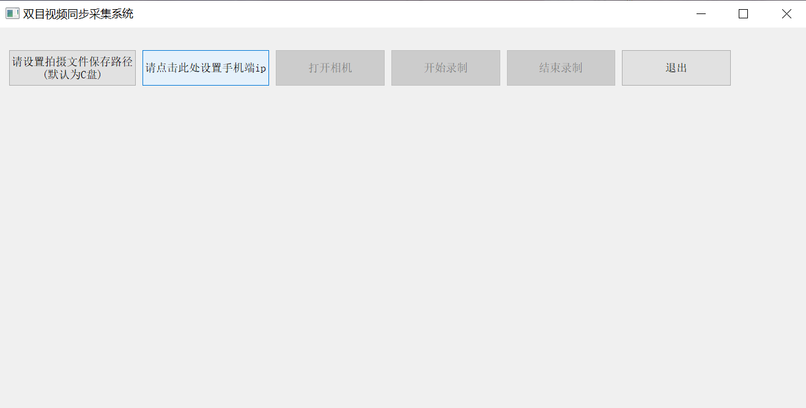
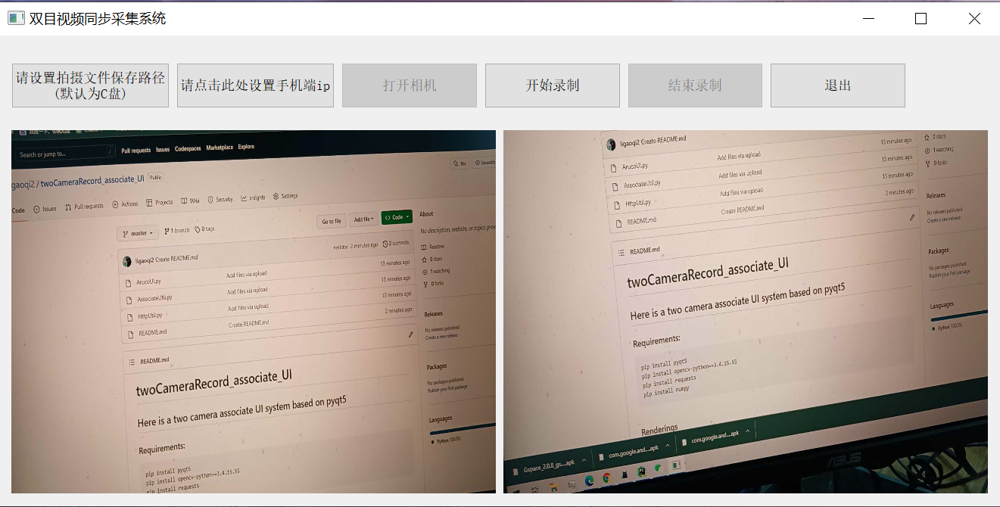

# twoCameraRecord_associate_UI
## Here is a two camera associate UI system based on pyqt5
We tend to use two Ipcameras to record different views' videos.  
We use the Android App Ip摄像头 in [Google play store](https://play.google.com/)(Can be downloaded from [App Download Link](https://play.google.com/store/apps/details?id=com.pas.webcam))   
We use `requests` to send http request to set focus length and stop changing focus length.  
We add the Record function by using the sub-sub QThread. The sub QThread is using to preview the image.  
Due to the main thread cannot send a signal to the child thread in Qthread, So we use the global variables as the trigger signal of Record.  
You can also download the [Aruco.exe](https://drive.google.com/file/d/1ws_l0VVdyTUz5JrJlbCa8dCuI5RnmZ15/view?usp=share_link) for Windows or generate the .exe by pyinstaller.  
```
pyinstaller -F -w ArucoUI.py
```
Please make sure two Ipcameras and the PC is under the same Wifi.  
## Please make a suggestion in Issues.
### Requirements:
```
pip install pyqt5
pip install opencv-python==3.4.15.55
pip install requests
pip install numpy
(Optional)pip install pyinstaller
```
### Renderings



# Contact us
```
ligaoqi02@gmail.com
```
# Acknowledgement
```
Thanks for Pavel Khlebovich and Ip Webcam APP.
```
